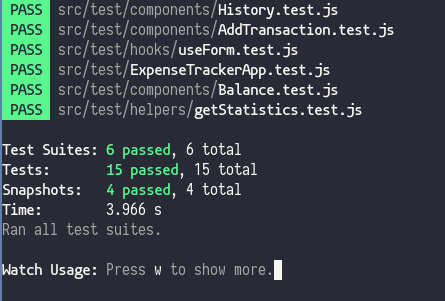

# [Expense Tracker](https://expense-tracker75.netlify.app)
Permite registrar tus gastos e ingresos y ver un historial de los 
mismos.

## Uso 
- `npm install` para restaurar las dependencias del proyecto.  
- Para levantar la aplicación `npm start`.  
- Para generar un build `npm run build`, y para ejecutar un servidor 
de dasarrollo instale [serve](https://www.npmjs.com/package/serve).

## Testing 
Use Jest para evaluar si se los componentes se mostraban correctamente y que los 
resultados a mostrar sean los esperados.  
`npm run test` para ejecutar el test suite de react.

## Construido con 

- React
- Bootstrap 

